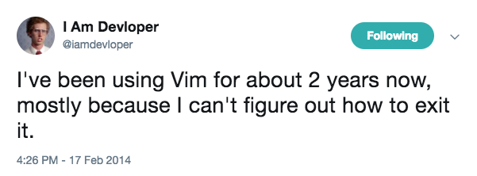

# Basic Vim

## Learning Objectives

By the end of this lesson you will be able to:

* Open and exit Vim

## Learning just a tiny bit of VIM

Vim is text editor that runs from your command line! You can read more about it and its relationship with `vi` [here](https://askubuntu.com/questions/418396/what-is-the-difference-between-vi-and-vim).

Don't be one of these people who get flustered just getting in and out of Vim. Let's learn the basics so that we know our way around it in the event a file gets opened with it. This will happen in the future once we start using git!

* [Opening and Closing Files with vi](http://www.linfo.org/vi/open.html)

## Challenges

<!-- Question -->

### !challenge

* type: short-answer
* id: ffe2ae30-b3d2-11e8-b5de-9f42ac92f790
* title: Basic Vim A

##### !question

How would you open a file called `classroom.txt` that's in the current directory with vim?

##### !end-question

##### !answer

/(vi|vim) (\.\/)?classroom\.txt/

##### !end-answer

##### !explanation

Correct!

##### !end-explanation

### !end-challenge

<!-- Question -->

### !challenge

* type: short-answer
* id: ffe2d540-b3d2-11e8-b5de-9f42ac92f790
* title: Basic Vim B

##### !question

How would you close out of a file where no changes have been made?

##### !end-question

##### !answer

/\:q/

##### !end-answer

##### !explanation

Correct!

##### !end-explanation

### !end-challenge

<!-- Question -->

### !challenge

* type: short-answer
* id: ffe2d541-b3d2-11e8-b5de-9f42ac92f790
* title: Basic Vim C

##### !question

How would you forcibly close out of a file where changes have been made and you _do not_ want to save?

##### !end-question

##### !answer

/\:q\!/

##### !end-answer

##### !explanation

Correct!

##### !end-explanation

### !end-challenge

<!-- Question -->

### !challenge

* type: short-answer
* id: ffe2d542-b3d2-11e8-b5de-9f42ac92f790
* title: Basic Vim D

##### !question

How would you close and save a file where you've made changes?

##### !end-question

##### !answer

/(\:qw|\:wq|ZZ)/

##### !end-answer

##### !explanation

Correct!

##### !end-explanation

### !end-challenge
