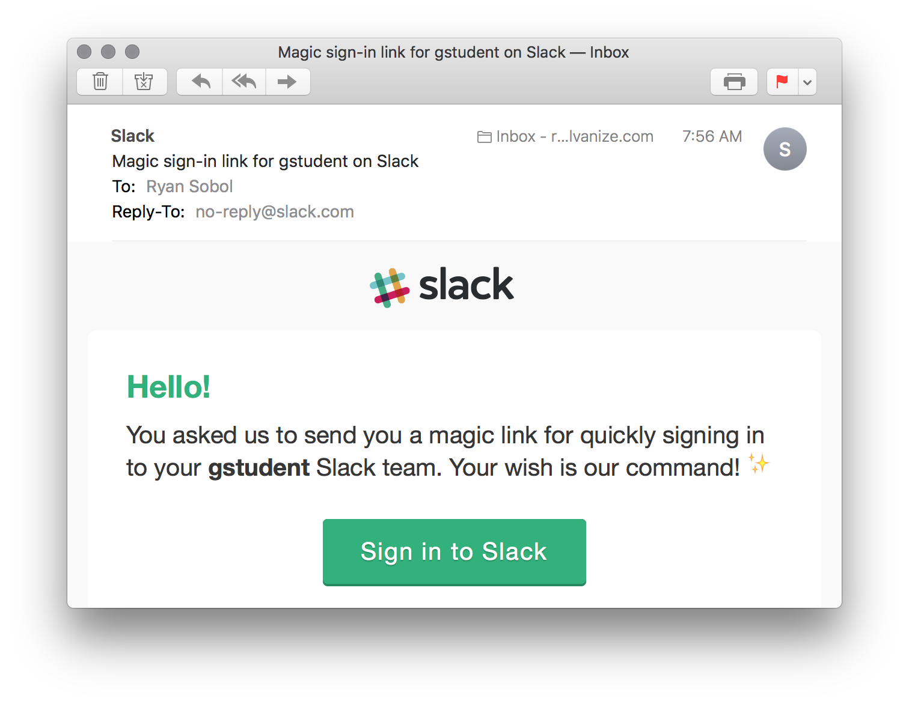

# Slack

## Learning Objectives

By the end of this lesson you will be able to:

* Install and configure the Slack Application

## Install Slack

[Slack](https://slack.com/) is a messaging application that brings team communication together into one simple place.

While it's possible to use Slack in your web browser, you'll find the native Slack application for macOS much more convenient for everyday use. To get started, [find Slack](https://itunes.apple.com/us/app/slack/id803453959?mt=12) in the Mac App Store and press the "Install" button.

**NOTE:** Once installed, you can close the Mac App Store by pressing the `Command` + `Q` keys at the same time.

## Configure Slack

Now, use Spotlight to launch the Slack app by pressing the `Command` + `Spacebar` keys at the same time, typing the word "slack" into the search field, and then pressing the `Enter` key.

Then, enter the `gstudents` team's Slack domain in the text field.

Next, enter the email address of your account for the `gstudents.slack.com` team.

Then, click on the "Send Magic Link" button to have magic sign in link sent to your email address.

Once the email is on it's way, check your email address for a new message from Slack. Once you find it, click on the "Sign in to Slack" button.

This will open a web browser and let you know that you're ready to connect the Slack application to the `gstudent` team. Go ahead and click the "Open Slack" button.

You'll be presented with a window that let's you know you're about to launch an application from Chrome. Click the "Launch Application" button to confirm.

And you should finally see something that looks like this.

## Challenges

<!-- Question -->

### !challenge

* type: multiple-choice
* id: ffe434d0-b3d2-11e8-b5de-9f42ac92f790
* title: Slack

### !question

Which one of the following is _not_ a default sidebar theme?

### !end-question

### !options

* Aubergine
* Ochin
* Monument
* Hoth
* Chickpea
* Work Hard

### !end-options

### !answer

Chickpea

### !end-answer

### !hint

Press `cmd + ,` to open up your preferences!

### !end-hint

### !end-challenge
