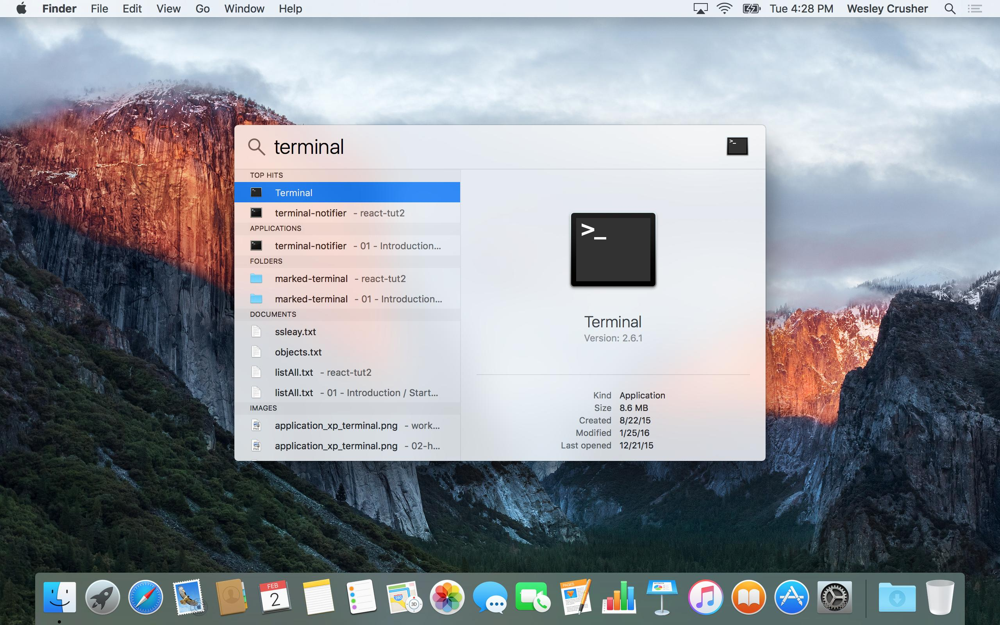
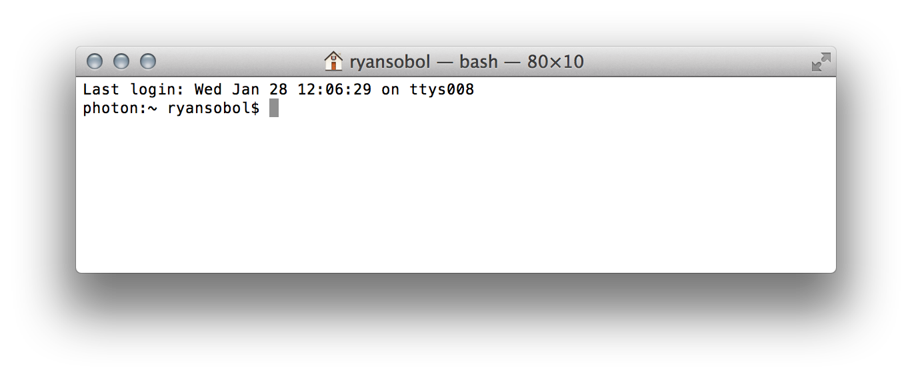
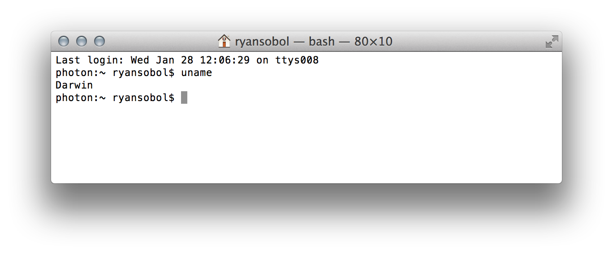
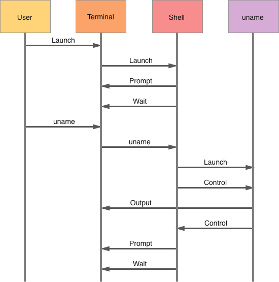
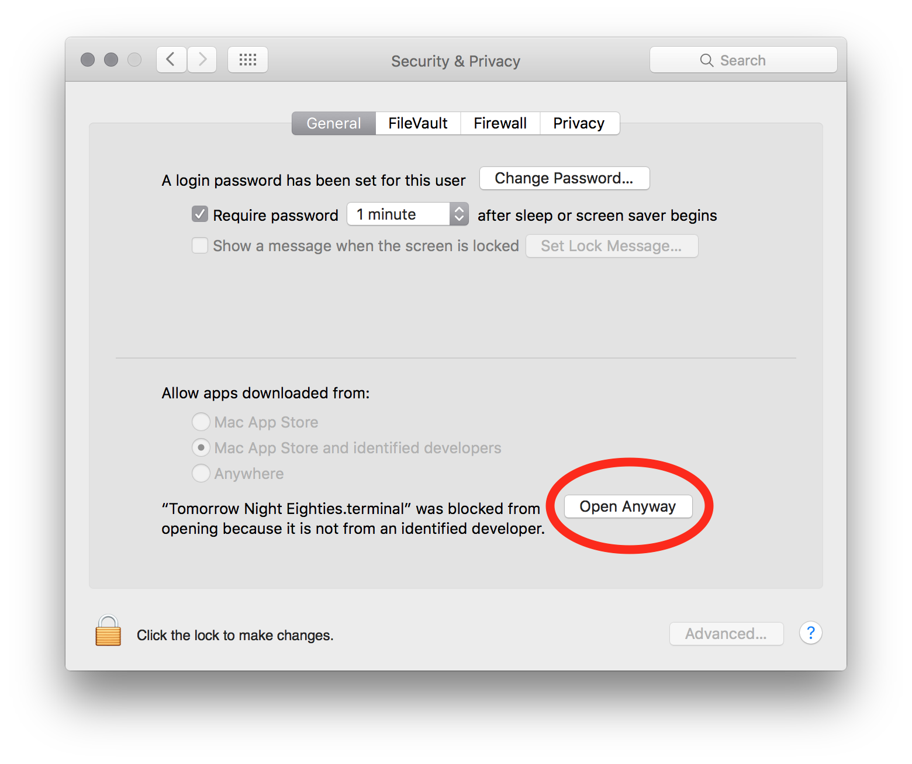
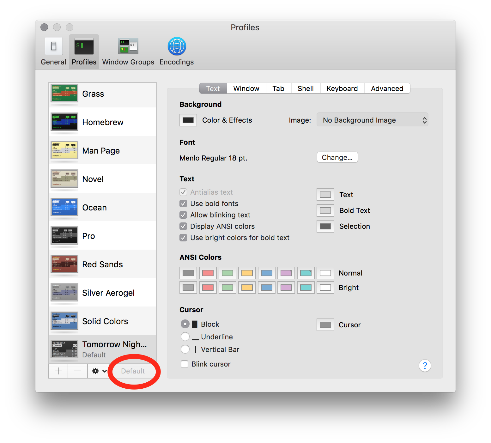
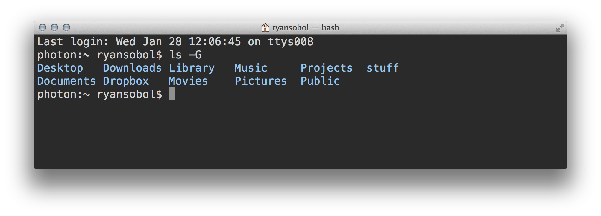
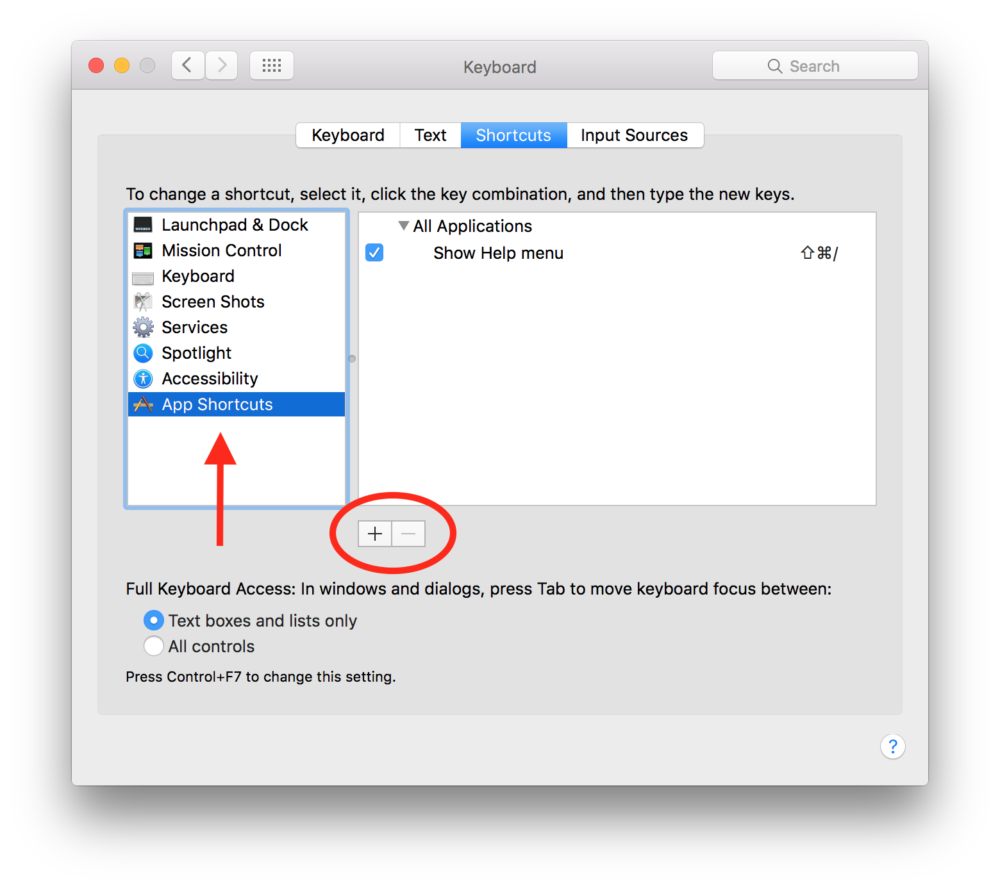
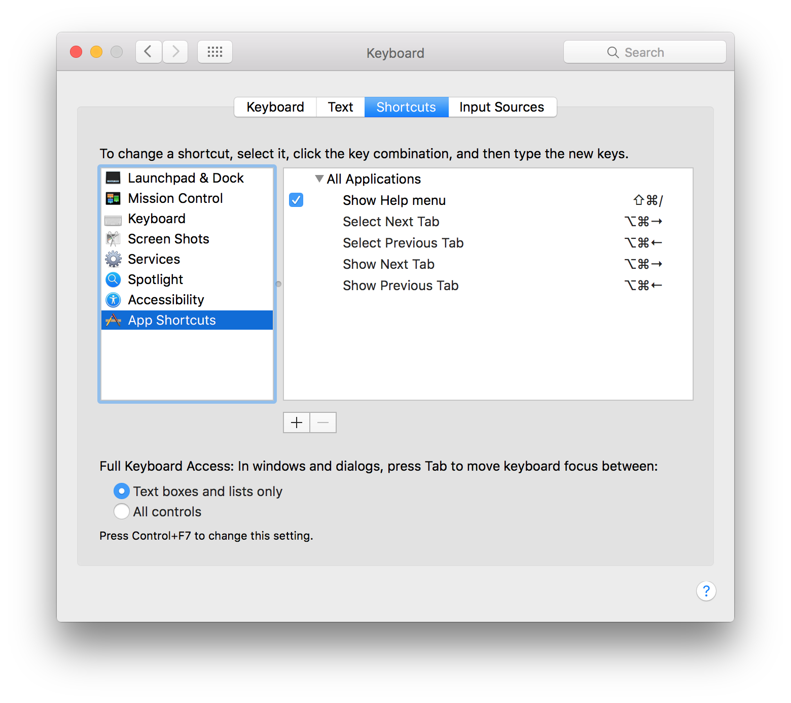

# Terminal

## Learning Objectives

By the end of this lesson you will be able to:

* Install and/or configure a terminal program

## Intro to the Terminal

Included in macOS is the **Terminal**—an app that runs a Unix shell, this will be where you begin your journey as a developer. A different unit will teach you the ins and outs of using it, but first you'll configure it so that it looks and feels great. Make sure to set up the navigation keyboard shortcuts so that you can save time later.

A **Unix shell** is a command line user interface between you and your computer's operating system. You're probably most familiar with the graphical user interface of an operating system. While that's technically a shell too, most developers think of the textual, command line interface when they hear the word _shell_. macOS blends both the graphical and the command line interfaces beautifully which is why it's so popular with developers.

The first Unix shell was released in 1971 and yet developers continue to incorporate them into their workflows. That's because Unix shells are both interactive and scriptable. In other words, the same commands that control an operating system from the command line can be included in a script file. A **script file** is commonly used to automate repetitive tasks and increase developer productivity. In this article, you'll download and run script files to speed up the installation and configuration of your development environment.

## Discover the Terminal

Let's get our hands dirty and have some fun. 🐾

First, use Spotlight to launch the Terminal app by pressing the `Command` + `Spacebar` keys at the same time, typing the word "terminal" into the search field, and then pressing the `Enter` key.

Once launched, you'll see something like this.

Here's a quick break down of what you're seeing in the Terminal app.

| Component             | Description                            |
| --------------------- | -------------------------------------- |
| `Wed Jan 28 12:06:29` | Date of your last login                |
| `ttys008`             | Name of your last terminal session     |
| `photon`              | Name of your computer                  |
| `~` (home directory)  | Name of your working directory         |
| `ryansobol`           | Name of your user account              |
| `$`                   | Prompt symbol                          |

Go ahead and type `uname` which is a command that will display your operating system's Unix name. Any characters you type will appear after the `$` prompt symbol. After pressing the `Enter` key, you'll see something like this.

**TIP:** The two most common Unix operating systems are Darwin and Linux.

Here's what happened:

1. The User launched the Terminal.
1. The Terminal launched a new Shell session.
1. The Shell told the Terminal to display a prompt.
1. The Shell told the Terminal to wait for the User to type a command.
1. The User typed in `uname`, which appeared after the prompt, and then pressed the `Enter` key.
1. The Terminal told the Shell that the User wants to run a command called `uname`.
1. The Shell searched for and launched a program called `uname`.
1. The Shell handed control over the Terminal to the `uname` program.
1. The `uname` program told the Terminal to display the word `Darwin`.
1. The `uname` program exited and handed control of the Terminal back to the Shell.
1. The Shell told the Terminal to display another prompt.
1. The Shell told the Terminal to wait for the User to type a command.

This sequence of events is known as a read-evaluate-print loop or **REPL** for short. This is just one example of a larger concept called the **Request-Response Cycle**. You'll study the cycle of sending a request and processing a response throughout this course as it's at the core of web development.

## Change the Terminal Profile

The default profile for the Terminal uses small, black text on a white background. Boring! Let's change that.

1. Download the [Tomorrow Night Eighties](https://raw.githubusercontent.com/ryansobol/sea-c17-ruby/master/class1/osx/Tomorrow%20Night%20Eighties.terminal) terminal profile by holding the `Option` key and left-clicking the link.
1. Navigate to the `Downloads` folder.
1. Install the profile by double-clicking the file.
1. You'll see an alert explaining the file "cannot be opened because it is from an unidentified developer". **Don't panic.**
1. Using Spotlight, open the `Security & Privacy` system preferences by pressing the `Command` + `Spacebar` keys at the same time, typing the word "security" into the search field, and then pressing the `Enter` key.
1. Navigate to the `General` tab and then click on the `Open Anyway` button. 
1. Press the `Command` + `Tab` keys at the same time to switch back to the Terminal app.
1. Navigate to the `Terminal > Preferences` menu item by pressing the `Command` + `,` keys at the same time.
1. In the preferences window, click the `Settings` Pane.
1. On the left side, scroll to the bottom, select the `Tommorrow Night Eighties` profile, and click the `Default` button. 
1. Quit the Terminal app by pressing the `Command` + `Q` keys at the same time.
1. Relaunch the Terminal using Spotlight like before.

Now, every new Terminal window will look like this.

## Add Universal Keyboard Shortcuts

Keyboard shortcuts on macOS typically consist of one or more of the following keys.

| Key         | Symbol |
|-------------|--------|
| `Command`   | ⌘      |
| `Option`    | ⌥      |
| `Control`   | ⌃      |
| `Function`  | fn     |
| `Shift`     | ⇧      |
| `Caps Lock` | ⇪      |

Unsurprisingly, macOS has a bunch of built-in keyboard shortcuts that are universal to all applications. For example, `Command` + `T` is the universal keyboard shortcut for creating a new application tab. Though there are keyboard shortcuts for switching between an application's tabs, you might be surprised to learn that these are not universal for all applications.

Since you'll be switching between tabs in applications like the Terminal, Google Chrome, and Atom all the time, let's add a few universal keyboard shortcuts for this.

1. Using Spotlight, open the `Keyboard` system preferences by pressing the `Command` + `Spacebar` keys at the same time, typing the word "keyboard" into the search field, and then pressing the `Enter` key.
1. Navigate to the `Shortcuts` tab, select `App Shortcuts` from the left pane, and then click on the `+` button. 
1. In the panel that slides down, add the following keyboard shortcuts to **All Applications**.

| Menu Title          | Keyboard Shortcut          | Symbols |
|---------------------|----------------------------|---------|
| Select Next Tab     | `Option` + `Command` + `→` | ⌥⌘→     |
| Select Previous Tab | `Option` + `Command` + `←` | ⌥⌘←     |
| Show Next Tab       | `Option` + `Command` + `→` | ⌥⌘→     |
| Show Previous Tab   | `Option` + `Command` + `←` | ⌥⌘←     |

By adding a keyboard shortcut, you're associating it with a possible menu title for all applications. The reason for the duplicate shortcuts is because different applications have differently named menu titles to switch between the next and previous tab.

When you're done, it should look like this.

## Challenges

<!-- Question -->

### !challenge

* type: multiple-choice
* id: e85abcd2-c733-4a2a-a23c-22d043364375
* title: Terminal

### !question

Check out the "Text" tab under "Profiles" in your Terminal's settings. Which one of the following is _not_ an option for the cursor?

### !end-question

### !options

* Block
* Forward Slash
* Underline
* Vertical Bar
* Blink Cursor

### !end-options

### !answer

Forward Slash

### !end-answer

### !hint

Press `cmd + ,` to open up your preferences!

### !end-hint

### !end-challenge
