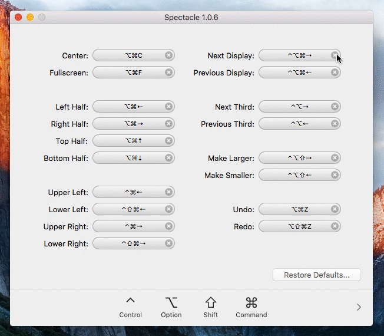
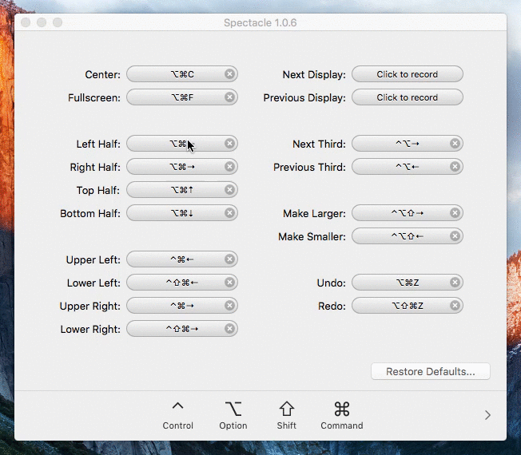

# Window Management

## Learning Objectives

By the end of this lesson you will be able to:

* Install and/or configure a window management tool

## Install and Configure Spectacle

You'll often find yourself working with multiple programs at the same time while you're developing. Smartly utilizing your screen space will allow you to work more efficiently.

To do so, we recommend using [Spectacle](https://www.spectacleapp.com/), a free application that allows you to manage your screen space with keyboard shortcuts. Download the application from the homepage and then drag the icon to your `Applications` directory. To open, press `Command` + `Spacebar` to open up Spotlight and then type in Spectacle.

Try out Spectacle by opening up a window in Chrome and pressing `Command` + `Option` + `Left / Right / Up / Down`. Your Chrome window should move around the screen and take up half the space! You can do this with any program so you could have Atom on one side of the screen and your terminal on the other.

Unfortunately, some of Spectacle's native commands now override the ability to switch between tabs on both our terminal and in Chrome! Let's fix those by setting up custom bindings. Instead of `Command` + `Option` + [Some Direction], we're going to do `Command` + `Option` + `Control` + [Some Direction].

Open up Preferences in Spectacle, and first delete the keybindings for Next Display and Previous Display.

Next, click the relevant bindings and then simply press the new keyboard commands you'd like to use.

That's it! You can now do all the things with your keyboard!
