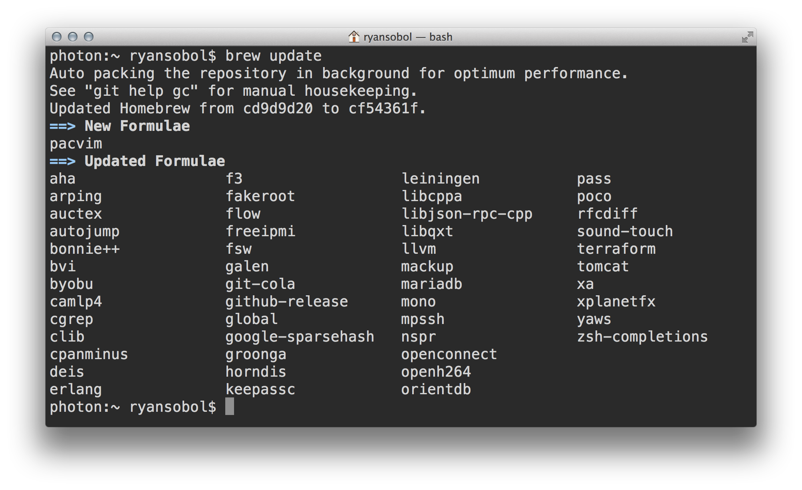
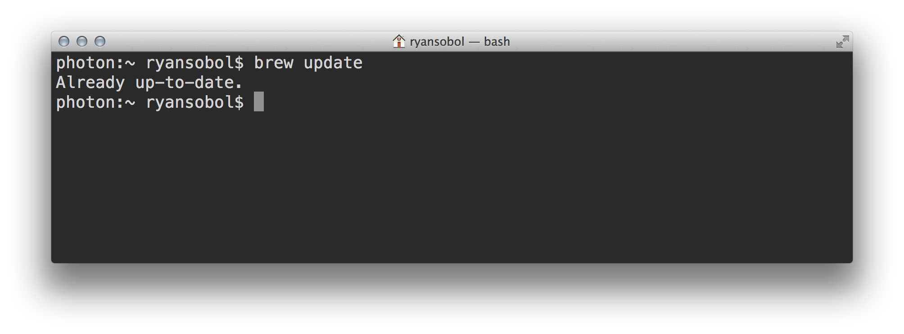
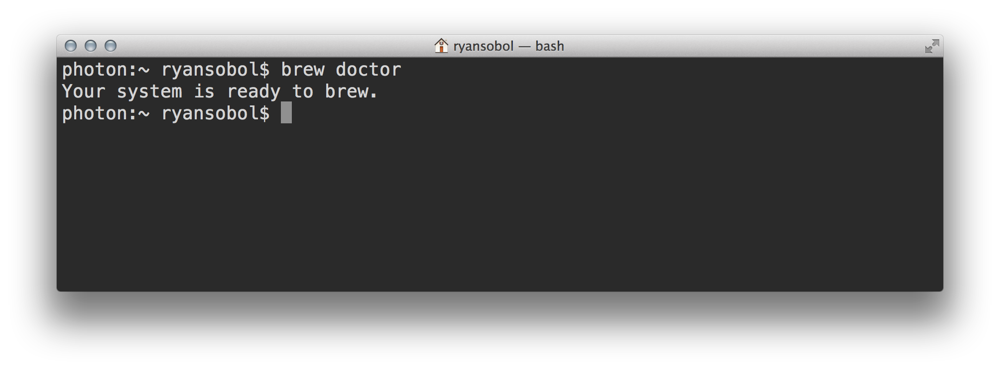

# Homebrew

## Learning Objectives

By the end of this lesson you will be able to:

* Install an operating system package manager

## Getting started with Homebrew

[Homebrew](http://brew.sh/) is the de facto package manager for macOS. If you've never heard of a package manager, think of it as an app store for **free** command line programs.

### Install Homebrew

To get started, run the following command in your shell. It'll download and run a script file that downloads and installs Homebrew onto your development environment.

```
ruby -e "$(curl -fsSL https://raw.githubusercontent.com/Homebrew/install/master/install)"
```

Be sure to agree when asked to install the **Xcode CommandLine Tools**. It may take about 10 minutes to download and install.

**TIP:** If needed, you can agree to the Xcode license by running the `sudo xcodebuild -license` command. This will require your account password which **will not** appear on the screen as you type.

### Update Homebrew

If you've previously installed Homebrew, now's a good time to update it by running the following command.

```
brew update
```

If it's been a while since the last update, you'll see something like this.



Otherwise, you'll see something like this.



**TIP:** Run this command periodically as Homebrew doesn't automatically update itself.

### Verify Homebrew

To verify Homebrew is installed correctly, run the following command.

```
brew doctor
```

And you'll see something like this.




Once Homebrew is successfully installed, install a command line tool named `cowsay`. You can install it by running the following command:

```bash
brew install cowsay
```

Once it's finished installing, try running this:

```bash
cowsay welcome to galvanize, buddy
```

There are many other tools you can install now that you have Homebrew. Ultimately, it's up to you! You may like the following, though:

* [Tree](https://formulae.brew.sh/formula/tree)
* [Speedtest-Cli](https://formulae.brew.sh/formula/speedtest-cli)

## Challenges

<!-- Question -->

### !challenge

* type: paragraph
* id: e39997b1-b3b0-11e8-99a4-573c60b11497
* title: Homebrew

### !question

In your own words describe what Homebrew is and why you installed it.

### !end-question

#### !placeholder

Write your answer here

#### !end-placeholder

### !explanation

Thanks! An instructor will follow-up if they have any questions.

### !end-explanation

### !end-challenge
