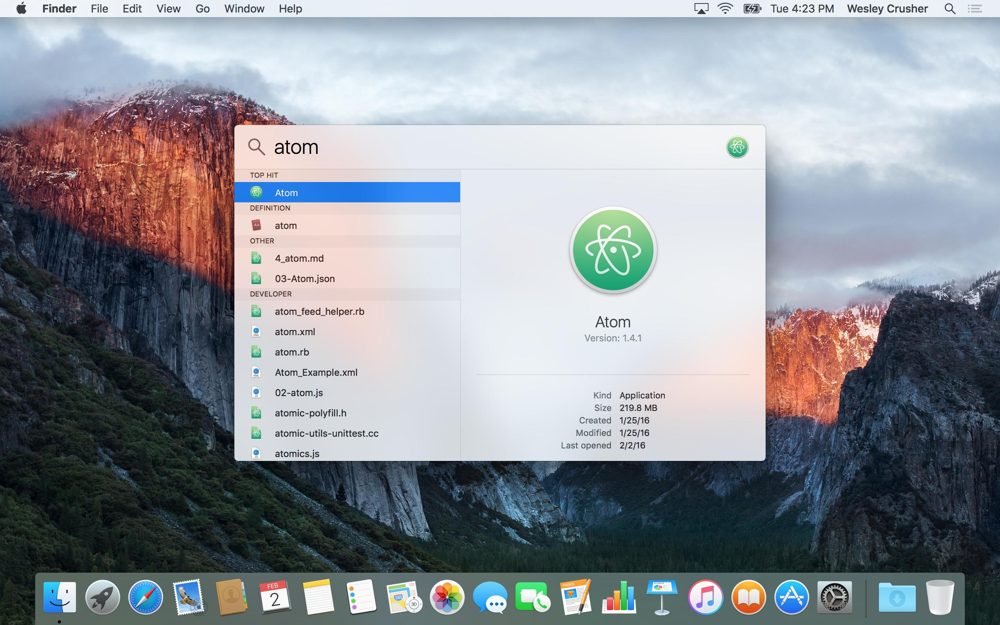
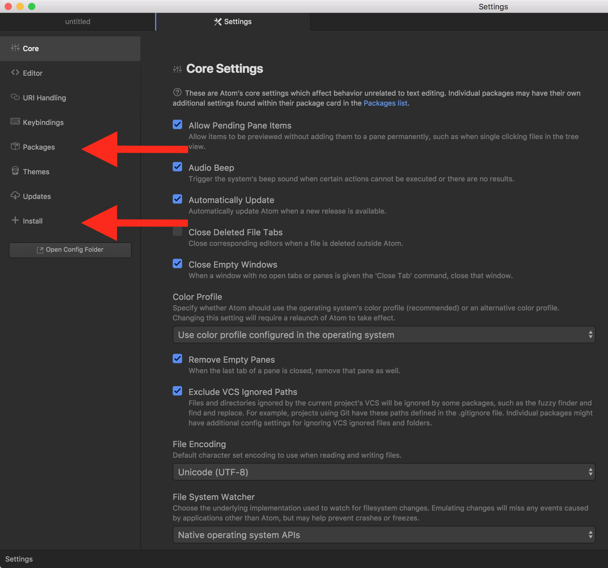
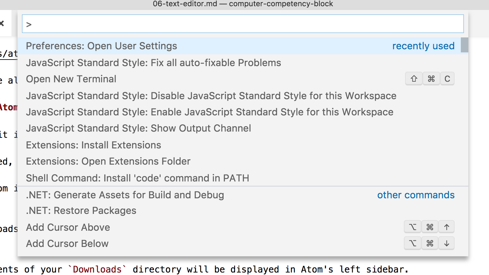
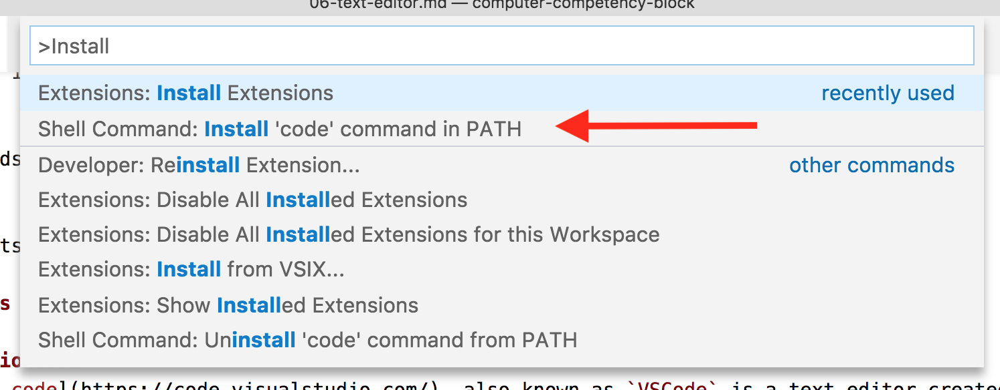
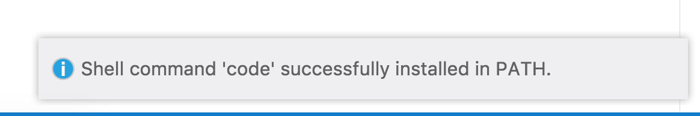
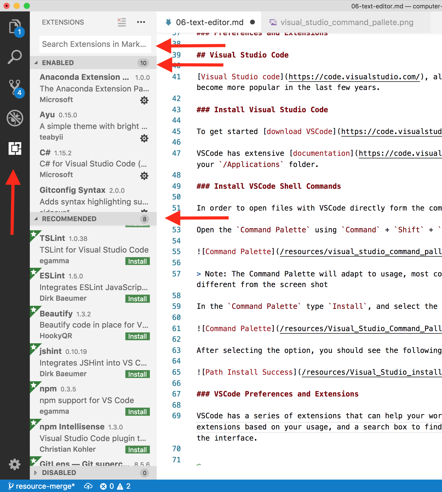

# Text Editors

## Learning Objectives

By the end of this lesson you will be able to:

* Install a text editor

## Atom

[Atom](https://atom.io/) is a hackable text editor for the 21st century. Atom was created by Github and has been the staple text editor for a number of years. It includes great support for packages and themes.

### Install Atom

To get started, [download Atom](https://atom.io/), unzip the archive file, and drag the app icon into your `/Applications` folder.

Once installed, use Spotlight to launch Atom by pressing the `Command` + `Spacebar` keys at the same time, typing the word "atom" into the search field, and then pressing the `Enter` key.



You can read about Atom in their [documentation page](https://atom.io/docs)

### Install Atom Shell Commands

You'll often find it useful to open files and directories into Atom from the Terminal.

To get started, select the `Atom > Install Shell Commands` menu item.

To verify Atom is wired up correctly, run the following command.

```bash
atom ~/Downloads
```

And the contents of your `Downloads` directory will be displayed in Atom's left sidebar.

### Atom Preferences and Packages

#### Preferences

Atom preferences can be accessed by pressing `Command + ,`. You'll see an interface with all the settings that can set in your editor. It's a lot of different options, so don't worry about knowing what everything does. You may only need to change a few preferences, and this is the place where you'll do it.

#### Packages

Atom gives you access to packages that will help your workflow. You can reach all currently installed packages and search for new packages to install from Atom **preferences**.



You'll will be installing packages as necessary to help out with your development process.

Here are a few resources on useful extensions

* [12 Must Have Atom Extensions To Work In Javascript](http://voidcanvas.com/12-must-have-atom-extensions-to-work-in-javascript/)

## Visual Studio Code

[Visual Studio code](https://code.visualstudio.com/), also known as **VSCode** is a text editor created by Microsoft. VSCode has become more popular in the last few years due to community support and constant updates. It includes a built in support for debugging `Node.js`, managing `git`, and great support for extensions.

### Install Visual Studio Code

To get started [download VSCode](https://code.visualstudio.com/), unzip the archive file, and drag the app icon into your `/Applications` folder.

You can read how to use VSCode in their [documentation](https://code.visualstudio.com/docs).

### Install VSCode Shell Commands

In order to open files with VSCode directly form the command line, you'll have to install a small command line application. To do so, open the `Command Palette` using `Command + Shift + P`.



> Note: The Command Palette will adapt to usage, most commonly used commands becoming sticky, your Command Palette might look different from the screen shot.

In the `Command Palette` type `Install`, and select the entry for `Shell Command: Install 'code' command in PATH`.



After selecting the option, you should see the following in the bottom right corner.



To verify VSCode is wired up correctly, run the following command.

```bash
code ~/Downloads
```

### VSCode Preferences and Extensions

#### Preferences

VSCode preferences can be accessed by pressing `Command + ,`. You'll see a text file with all the settings that set in your editor. It's a lot of different setting, so don't worry about knowing what everything does. You may only need to change a few preferences, and this is the place where you'll do it.

#### Extensions

VSCode has number of extensions that will help your workflow. You can find all the extensions that you have installed, recommended extensions based on your usage, and a search box to find extensions, by clicking on the fourth icon down on the bar to the left of the interface.



You will be installing extensions as necessary to help out with your development process.

Here are a few resources on useful extensions:

* [Top Javascript VScode Extensions For Faster Development](https://codeburst.io/top-javascript-vscode-extensions-for-faster-development-c687c39596f5)
* [VSode Extensions For Happier Javascript Coding](https://hackernoon.com/vs-code-extensions-for-happier-javascript-coding-e258f72dd9c1)