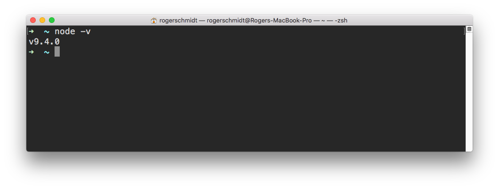
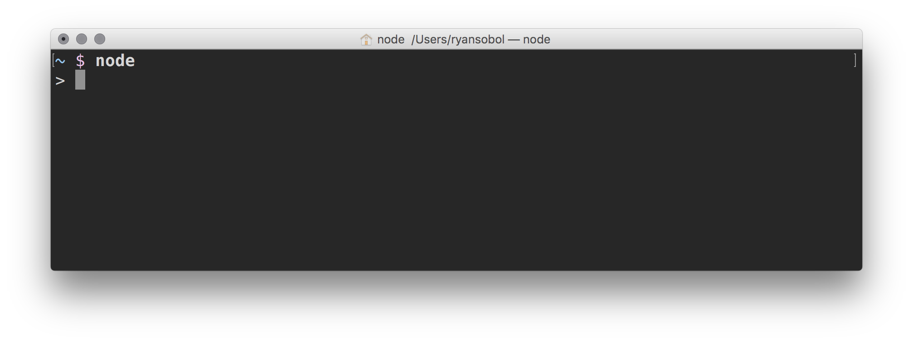
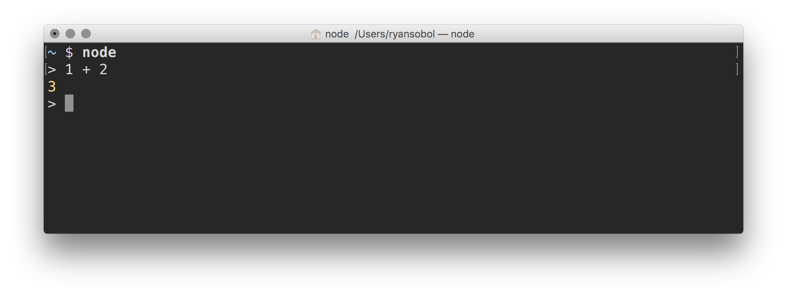
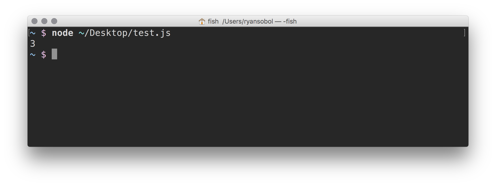

# Node

## Learning Objectives

By the end of this lesson you will be able to:

* Install node using brew

## Installing Node

[Node](https://nodejs.org) is an open-source, cross-platform runtime system for developing applications in JavaScript. In other words, it runs JavaScript outside the browser.

To get started, run the following command.

```bash
brew install node
```

Once it finishes, run the following command.

```bash
node -v
```

And you'll see something like this.



> Note: Your version number might be different.

### Discover the Node Shell

The interactive **Node shell** provides a read-evaluate-print-loop (REPL) for JavaScript programs.

To get started, launch the Node shell by running the following command.

```bash
node
```

And you'll see something like this.



After the prompt `>`, you can type a line of JavaScript code and then press the `Enter` key to run it. For example, type and run the following JavaScript program.

```javascript
1 + 2
```

And you'll see something like this.



The Node shell is a great tool for learning and experimenting with JavaScript.

Play around with JavaScript on your own. When you're done, type `.exit` and press the `Enter` key to quit the Node shell.

**TIP:** You can also press the `Command` + `D` keys to exit the Node shell.

### Discover the Node Interpreter

Given a JavaScript program stored in a file, the **Node interpreter** reads it, evaluates it, and then quits.

Unlike the Node shell, the Node interpreter is _not_ interactive. In other words, the Node interpreter won't automatically print the result of each line or loop waiting for you to give it more input. It just reads and evaluates a JavaScript program file.

Despite these deficiencies, you'll use the Node interpreter more frequently. Let's try it out.

First, open a new JavaScript program file in Atom.

```bash
code ~/Desktop/test.js
```

**TIP:** JavaScript program files end with a `.js` extension.

Then type the following program into the file.

```bash
1 + 2;
```

Save the file and run the program using the Node interpreter.

```bash
node ~/Desktop/test.js
```

Weird, nothing happened. Remember, the Node interpreter won't print anything unless told.

Change the program so it reads like this.

```javascript
console.log(1 + 2);
```

Save the file and re-run the program.

```javascript
node ~/Desktop/test.js
```

And you'll something like this.



Play around with JavaScript on your own. When you're done, remove the `test.js` file by running the following command.

```bash
rm ~/Desktop/test.js
```

## Challenges

<!-- Question -->

### !challenge

* type: multiple-choice
* id: a4e0de20-b3ab-11e8-ab3a-7533acfb07e7
 title: Node REPL

### !question

What does REPL stand for?

### !end-question

### !options

* Read, Process, Loop
* Recurse, Print, Lisp
* Read, Execute, Process, Lisp
* Read, Eval, Process, Loop
* Recurse, Eval, Parse, Loop
* Read, Eval, Print, Loop

### !end-options

### !answer

Read, Eval, Print, Loop

### !end-answer

### !end-challenge