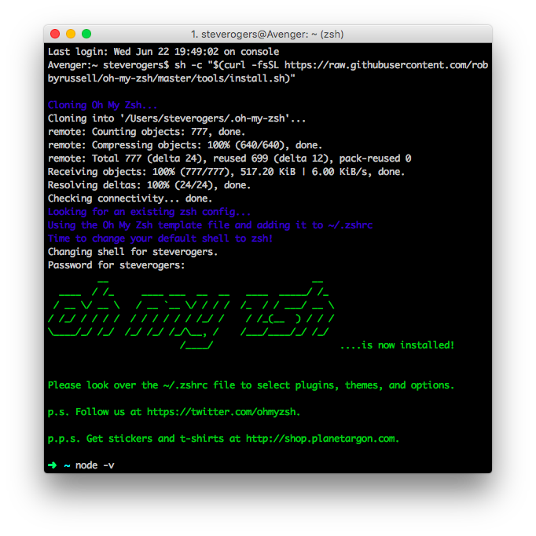

# Zsh

## Learning Objectives

By the end of this lesson you will be able to:

* Customize command line prompt with zsh themes

## Customizing the command line

Because you'll be working with the shell frequently, it's important to make the experience as efficient and fun as possible. There are many command line shells available to choose from, each with their own strengths. This course will have everyone start together using Zsh and Oh My Zsh, but you can work with a different option in the future.


## Install and Configure Zsh

Because you'll be working with the shell often, it's important to make the experience as efficient and fun as possible. Remember, a shell is simply the user interface between you and your computer's operating system.

There are many command line shells available to choose from, each with their own strengths. This course will have everyone start together using Zsh and Oh My Zsh, but you can work with another in the future.

You should actually already have zsh installed. To check, run the following command.

```bash
zsh --version
```

You should receive some output that looks like this.

```bash
zsh 5.0.8 (x86_64-apple-darwin15.0)
```

That means all you need to do is install [Oh My Zsh](https://github.com/robbyrussell/oh-my-zsh), which is simply a framework for managing your zsh configuration. It's like icing on a delicious, shell cake. Read the instructions on how to install via the Github repository.

**TIP:** This will require your account password which **will not** appear on the screen as you type.

You should end up with something like the following:



With zsh, you can set up some really great themes that will give you more information as you interact with the shell, making it much easier to use. You'll do that in the next session after you've installed Atom.

## Edit Your zsh Theme

Running the following command should open a file with atom:

```
atom ~/.zshrc
```

This is your zsh config file, which allows you to manage your shell's settings in all kinds of ways. You should see on or around Line 8 the following:

```
ZSH_THEME="robbyrussell"
```

What's between the `"`s is the name of the theme that's currently in play. There's a great website that allows you to preview the hundreds of themes available to zsh called [zshthem.es](http://zshthem.es/). A good theme should:

1. Give you some indication as to where you are in the file system.
1. Not be so cluttered that you can't distinguish between the theme and what you're typing.
1. When working with git, should give you some indication as to what branch you're on and if you have any uncommitted files.

To change your theme, you simply need to change the name from `robbyrussell` to whatever the name of the theme is. You could spend a lot of time doing this, so for now start with either `clean` or `ys`.

Once you have changed the file, save it (with `Command` + `S`) and then open up a new terminal window. You should see your new theme in place!


## Challenges

<!-- Question -->

### !challenge

* type: multiple-choice
* id: 26b0db80-b3d9-11e8-89b8-f32133e66ea3
* title: Customizing the Shell A

### !question

If you wanted to change the colors of your terminal, where would you go?

### !end-question

### !options

* Terminal Settings
* Zsh Config
* Homebrew

### !end-options

### !answer

Terminal Settings

### !end-answer

### !end-challenge

<!-- Question -->

### !challenge

* type: multiple-choice
* id: 26b0db81-b3d9-11e8-89b8-f32133e66ea3
* title: Customizing the Shell B

### !question

If you wanted to change your prompt, where would you go?

### !end-question

### !options

* Terminal Settings
* Zsh Config
* Homebrew

### !end-options

### !answer

Zsh Config

### !end-answer

### !end-challenge
