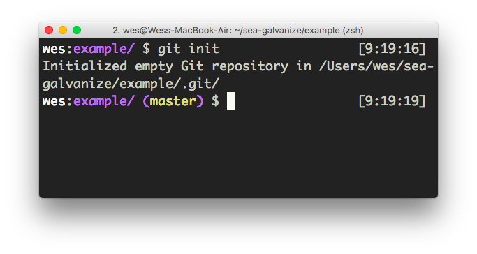
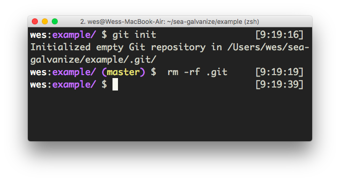

# Initialize and Remove Repositories

Complete just the following lesson on Codecademy:

* [Git Init on Codecademy](https://www.codecademy.com/en/courses/learn-git/lessons/git-workflow/exercises/git-init)

The `git init` command creates what is called a local repository or project. You should notice after running it that your command prompt changes.

The folder above is now a git project. After you've run the `init` command, you'll notice that there is now a hidden `.git/` folder inside your project. You're now ready to start working with git!

One important thing to keep in mind is that git projects _cannot have children that are also git projects._ That is, if I created a new folder inside of a git project and ran `git init` there, I would encounter a number of problems. If you ever need to remove a git project, just remove the `.git/` folder.

## Challenges

<!-- Question -->

### !challenge

* type: short-answer
* id: c0db4820-b3bc-11e8-9f6a-6732205b0888
* title: Practicing with Git

##### !question

It's best to practice working with git on your own computer. Create a new folder called `practicing-with-git`. Go into that folder and then print out the working directory with `pwd`. Paste your file path here.

##### !end-question

##### !answer

/\/Users\/.+\/practicing-with-git/

##### !end-answer

### !end-challenge

<!-- Question -->

### !challenge

* type: short-answer
* id: c0db4821-b3bc-11e8-9f6a-6732205b0888
* title: Create a new Git Project

##### !question

What command should you run to create a new git project? Type that command into your `practicing-with-git` folder.

##### !end-question

##### !answer

/git init/

##### !end-answer

### !end-challenge
