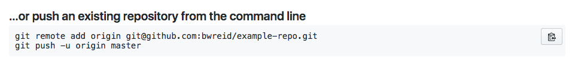

# Synchronize Git & Github

In order to maximize our use of Git & Github, we'll need to synchronize the two. Let's start by making a new repository on GitHub -- _not a new local git repository_.

You may call your repository whatever you want. You will now be prompted with two sets of instructions. Stop there!

Create a local git repository on your machine -- _not a new GitHub repository_ -- then add a file. Commit that file with a commit message. Once everything is good locally, copy the two lines you see on the page that look similar to this:

Paste those two lines into your terminal where your local git repository is. Refresh your page on GitHub and you should now see your file up on the interwebs!

Watch the following two videos to learn more about how Git and GitHub are related and the commands you can use to synchronize between the two.

## Git Add, Commit, and Push

### !vimeo
* id: 223815936
### !end-vimeo

## Git Fetch, Push, and Pull

### !vimeo
* id: 223815938
### !end-vimeo

## Challenges

<!-- Question -->

### !challenge

* type: paragraph
* id: 06c3e520-b3c9-11e8-86aa-2d44bc389978
* title: Git and GitHub

### !question

In your own words, describe the rocket ship analogy in terms of how it relates to git and GitHub.

### !end-question

#### !placeholder

Write your answer here

#### !end-placeholder

### !explanation

Thanks! An instructor will follow-up if they have any questions.

### !end-explanation

### !end-challenge

<!-- Question -->

### !challenge

* type: multiple-choice
* id: 06c40c30-b3c9-11e8-86aa-2d44bc389978
* title: Git Push, Fetch, and Pull A

### !question

The `pull` command is the combination of what two other commands?

### !end-question

### !options

* `fetch` and `push`
* `push` and `merge`
* `fetch` and `merge`

### !end-options

### !answer

`fetch` and `merge`

### !end-answer

### !end-challenge

<!-- Question -->

### !challenge

* type: short-answer
* id: 06c40c31-b3c9-11e8-86aa-2d44bc389978
* title: Git Push, Fetch, and Pull B

##### !question

A classmate has pushed up a new commit to GitHub on a repository you're both working on. What single command should you run?

##### !end-question

##### !answer

/git pull(.+)?/i

##### !end-answer

### !end-challenge
