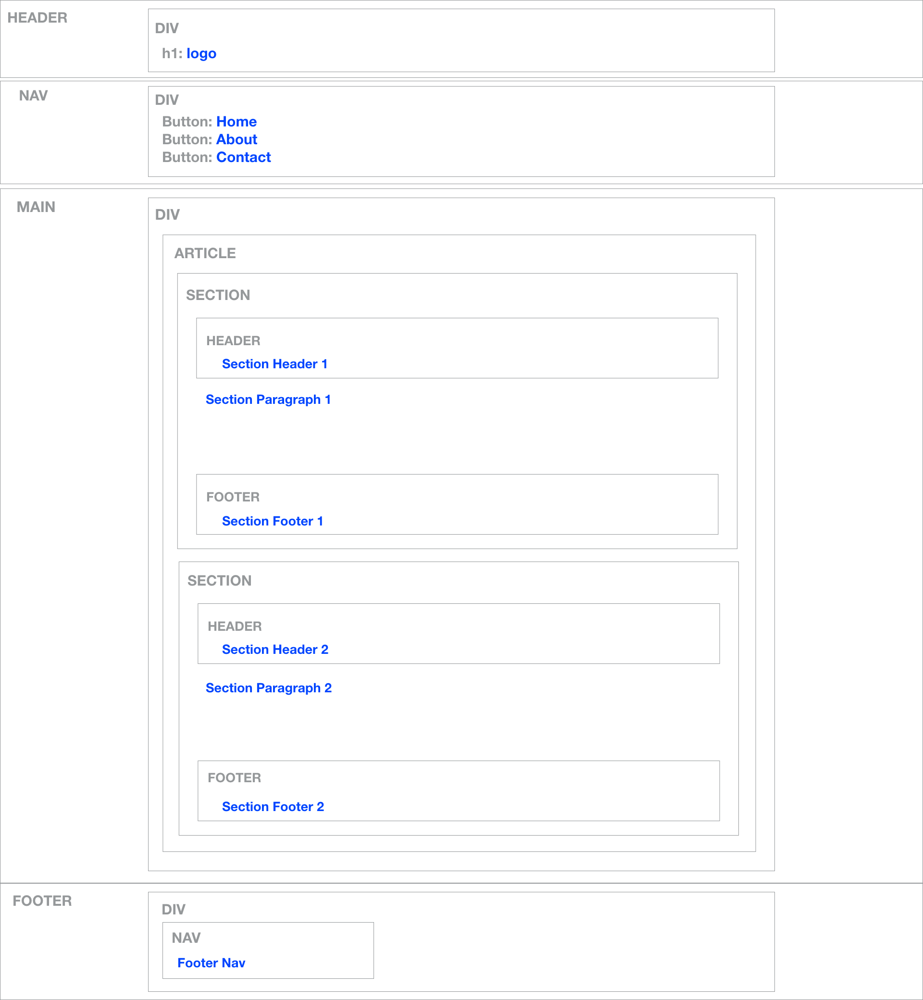

# Checkpoint: Use Semantic Containers to organize your webpage 

### !challenge

* type: project
* id: def96b5a-0cdb-4497-907e-1f5ea8406ff4
* title: Use Semantic Containers to communicate about the structure of your page

##### !question

Given the following wireframe, determine the organization of the HTML containers:

Using JSFiddle below, write the HTML code to build the containers properly around the existing text. In order to help improve the visual presentation for debugging, some CSS styles have been added. You can compare your work with the completed version below. You don't have to make any edits to the CSS, all of those techniques will be explained in the CSS lesson.  

<iframe width="100%" height="300" src="//jsfiddle.net/s599x3c2/embedded/html,css,result/" allowfullscreen="allowfullscreen" frameborder="0"></iframe>

##### !end-question

##### !placeholder

Submit your JSFiddle link here

##### !end-placeholder

##### !explanation

## Container Challenge Solution

If you organize your HTML properly, it should look like this example below. Try not to look at the HTML code unless you really need the assistance.

<iframe height='537' scrolling='no' title='Container Solution' src='//codepen.io/mjhea0/embed/woLbxQ/?height=537&theme-id=16667&default-tab=result&embed-version=2' frameborder='no' allowtransparency='true' allowfullscreen='true' style='width: 100%;'>See the Pen <a href='http://codepen.io/mjhea0/pen/woLbxQ/'>Container Solution</a> by Michael Herman (<a href='http://codepen.io/mjhea0'>@mjhea0</a>) on <a href='http://codepen.io'>CodePen</a>.
</iframe>

##### !end-explanation

### !end-challenge

### !challenge

* type: paragraph
* id: 60b40163-b1a0-400e-8886-b3d816025432
* title: Explain the purpose

##### !question

What is the purpose of the `header` container?

##### !end-question

### !end-challenge
### !challenge

* type: paragraph
* id: 2d4fa4a3-7456-4c97-8cc1-1d56e1b438ba
* title: Explain the purpose

##### !question

What is the purpose of the `nav` container?

##### !end-question

### !end-challenge
### !challenge

* type: paragraph
* id: 12c6bbf6-0403-4740-bd1c-069bacb6a2c3
* title: Explain the purpose

##### !question

What is the purpose of the `footer` container?

##### !end-question

### !end-challenge
### !challenge

* type: paragraph
* id: 61f32f0c-6f2d-42b1-b7cd-154f7366e3e3
* title: Explain the purpose

##### !question

What is the purpose of the `main` container?

##### !end-question

### !end-challenge
### !challenge

* type: paragraph
* id: 3426b79f-32b2-4d1a-9918-cf252b4abaee
* title: Explain the purpose

##### !question

What is the purpose of the `article` container?

##### !end-question

### !end-challenge
### !challenge

* type: paragraph
* id: 4cb625ff-a337-4628-a74b-d85379b454b6
* title: Explain the purpose

##### !question

What is the purpose of the `section` container?

##### !end-question

### !end-challenge
### !challenge

* type: paragraph
* id: 5b0fc5e0-4b14-4751-8200-a577968af393
* title: Explain the purpose

##### !question

What is the purpose of the `div` container?

##### !end-question

### !end-challenge
