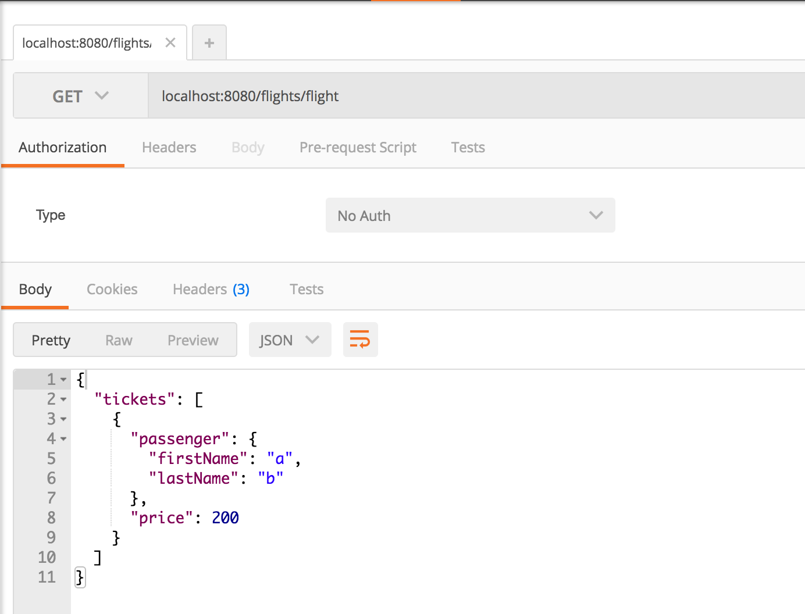
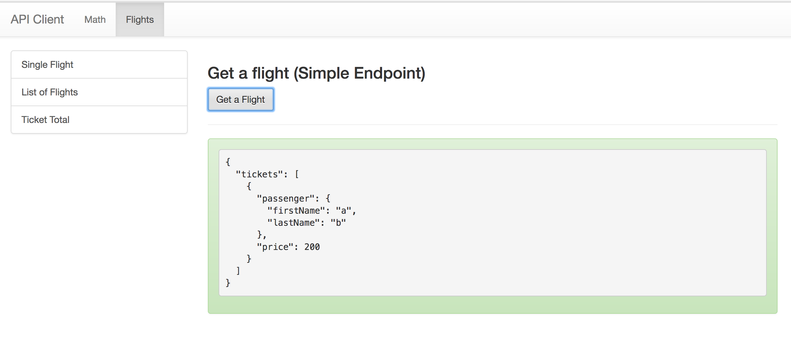

# Express Flights: GET a Flight

## Description

### Endpoint #1: Single Flight

In your express-playground application, create an endpoint that:

1. Takes a `GET` request to `/flights/flight`
1. Renders JSON like this:

  ```json
  {
    "departs": "2017-04-21 14:34",
    "tickets": [
      {
        "passenger": {
          "firstName": "Some name",
          "lastName": "Some other name"
        },
        "price": 200
      }
    ]
  }
  ```

NOTE: you may want to use `momentjs` to format the dates

### Endpoint #2: List of Flights

In your express-playground application, create an endpoint that:

1. Takes a `GET` request to `/flights`
1. Renders JSON like this:

  ```json
  [
    {
      "departs": "2017-04-21 14:34",
      "tickets": [
        {
          "passenger": {
            "firstName": "Some name",
            "lastName": "Some other name"
          },
          "price": 200
        }
      ]
    },
    {
      "departs": "2017-04-21 14:34",
      "tickets": [
        {
          "passenger": {
            "firstName": "Some other name",
            "lastName": null
          },
          "price": 400
        }
      ]
    }
  ]
  ```

## Seeing it in Development

You should be writing tests for this.  But you may also want to see it running in your dev environment.  Here are a few options:

### cURL

```
curl -i localhost:8080/flights/flight

curl -i localhost:8080/flights
```

### Postman

You can use [Postman](https://www.getpostman.com/) (free chrome extension).



### API Client

You can _optionally_ download the [API Client Application](https://github.com/gSchool/react-examples/tree/master/api-client) to help have a visual way of checking your work as you go.




### !challenge
* type: project
* id: bd37acf8-bc37-48ba-ab66-76e4119fbf4e
* title: Flight

##### !question

1. Write a test
1. Make the test pass
1. Commit and push your changes to GitHub

Then paste the URL to your playground repo below
##### !end-question

##### !placeholder
https://github.com/<your name>/express-playground
##### !end-placeholder

##### !explanation
Thank you!
##### !end-explanation
### !end-challenge
