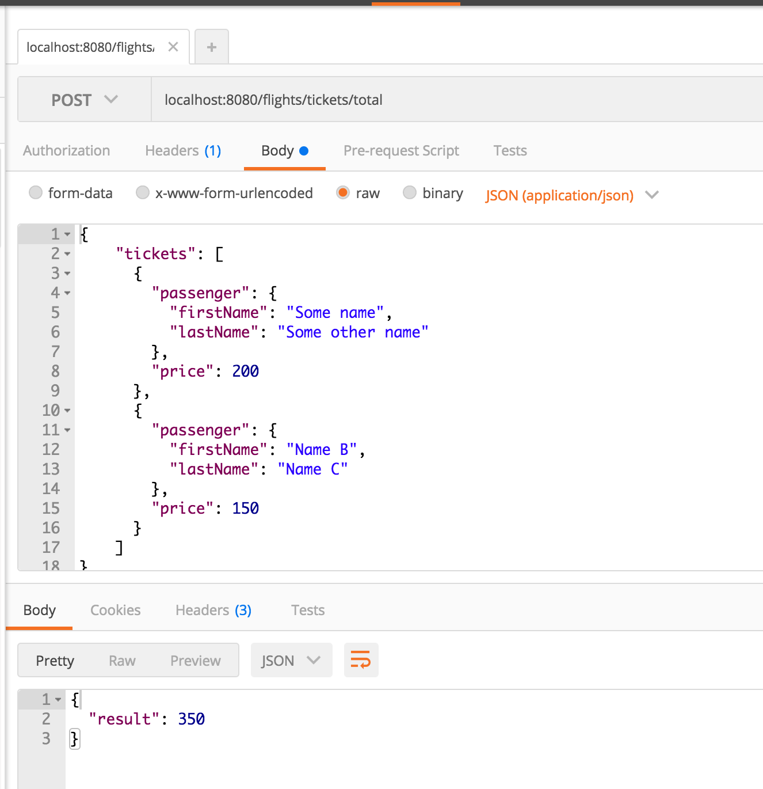
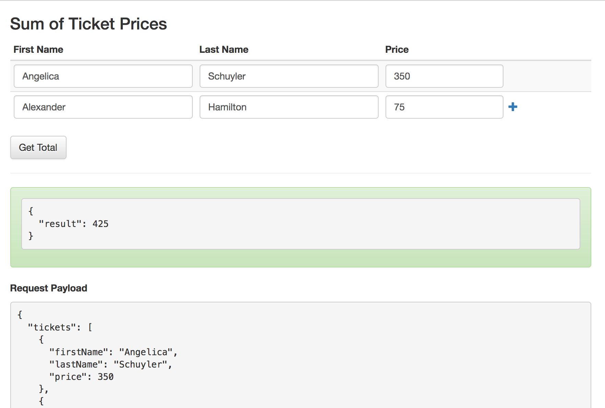

# Express Flights: Calculate Ticket Total

## Description

### Endpoint #1: Ticket Total

In your express-playground application, create an endpoint that:

Takes a `POST` request to `/flights/tickets/total` with the following JSON:

  ```json
  {
    "tickets": [
      {
        "passenger": {
          "firstName": "Some name",
          "lastName": "Some other name"
        },
        "price": 200
      },
      {
        "passenger": {
          "firstName": "Name B",
          "lastName": "Name C"
        },
        "price": 150
      }
    ]
  }
  ```

And calculates the _sum_ of the ticket prices, then renders it like so:

```json
{
  "result": 350
}
```

## Seeing it in Development

You should be writing tests for this.  But you may also want to see it running in your dev environment.  Here are a few options:

### cURL

```
curl -X POST -H "Content-Type: application/json" -d '{
  "tickets": [
    {
      "passenger": {
        "firstName": "Some name",
        "lastName": "Some other name"
      },
      "price": 200
    },
    {
      "passenger": {
        "firstName": "Name B",
        "lastName": "Name C"
      },
      "price": 150
    }
  ]
}
' "http://localhost:8080/flights/tickets/total"
```

### Postman

You can use [Postman](https://www.getpostman.com/) (free chrome extension).



### API Client




### !challenge
* type: project
* id: 2ced19a7-276b-44e1-9066-9be930892362
* title: Ticket Total

##### !question

To submit:

1. Write 1 test
1. Make the test pass
1. Commit and push your changes to GitHub

Then paste the URL to your playground repo below
##### !end-question

##### !placeholder
https://github.com/<your name>/express-playground
##### !end-placeholder

##### !explanation
Thank you!
##### !end-explanation
### !end-challenge
