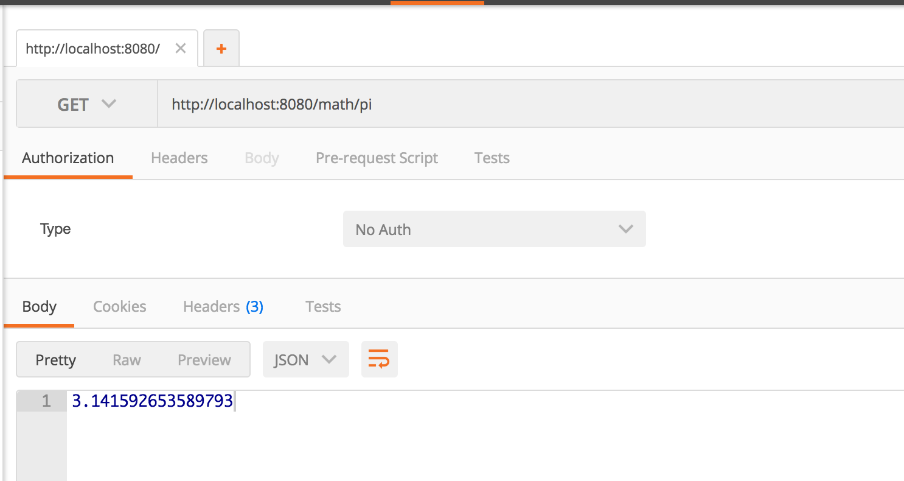
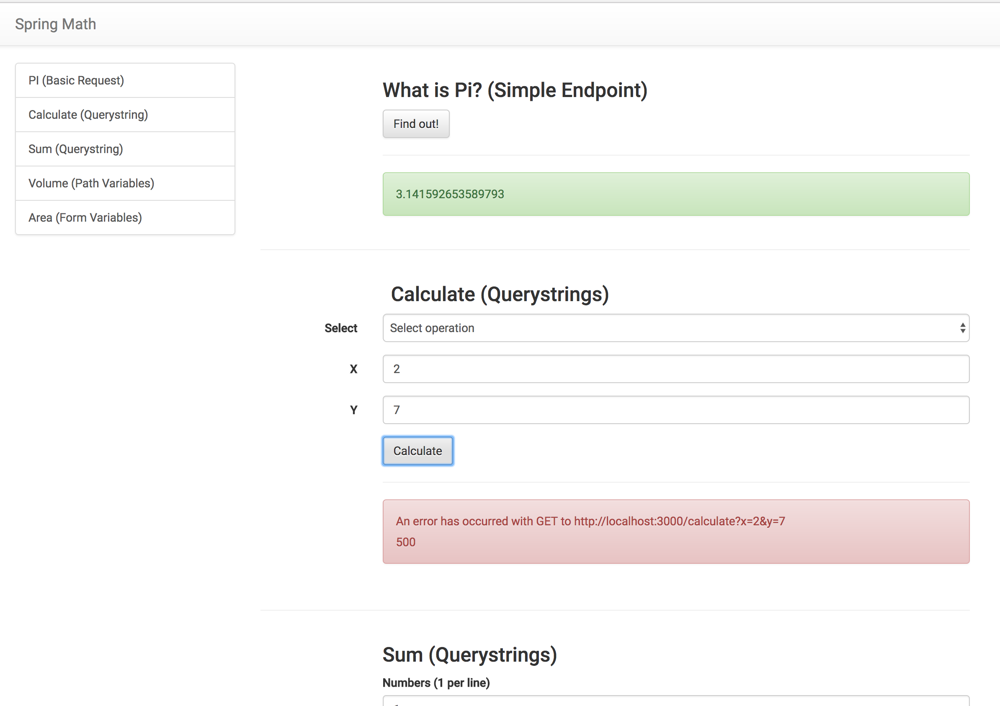

# Express Math: PI with GET

## Description

In your express-playground application, create an endpoint that:

- takes a `GET` request to `/math/pi`
- renders the string `3.141592653589793` (HINT: JavaScript has a builtin constant for this 😉)

## Running in Development

Run your application locally if you'd like to test it out:

```
nodemon
```

## Seeing it in Development

You should be writing tests for this.  But you may also want to see it running in your dev environment.  Here are a few options:

### cURL

```
curl -i localhost:8080/math/pi
```

### Postman

You can use [Postman](https://www.getpostman.com/) (free chrome extension).



### API Client

You can _optionally_ download the [API Client Application](https://github.com/gSchool/react-examples/tree/master/api-client) to help have a visual way of checking your work as you go.



Either start your app on `PORT=8080` or adjust the PORT references in `package.json` in the API client.

### !challenge
* type: project
* id: 4407642f-3126-4cf6-8fc8-0aafc732738d
* title: PI

##### !question

1. Write a test
1. Make the tests pass
1. Commit and push your changes to GitHub

Then paste the URL to your playground repo below
##### !end-question

##### !placeholder
https://github.com/<your name>/express-playground
##### !end-placeholder

##### !explanation
Thank you!
##### !end-explanation
### !end-challenge
