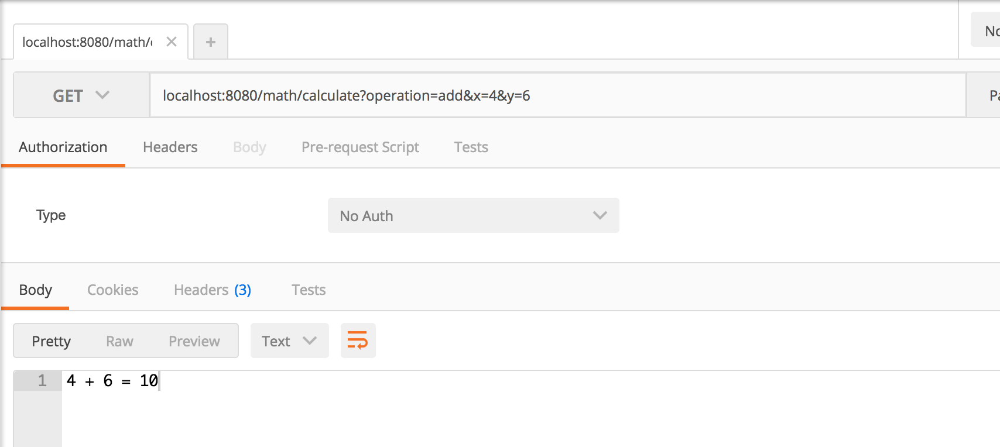
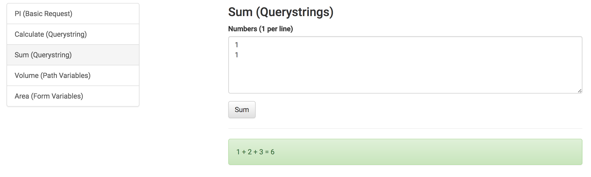

# Express Math: Calculate with Querystrings

## Endpoints

### #1 - /math/calculate

In your express-playground application, create an endpoint that takes `GET` requests to `/math/calculate`, which takes 3 query parameters:

- `operation`: Which can be `add`, `subtract`, `multiply`, `divide` (optional)
- `x`: A number (required)
- `y`: A number (required)

#### Examples

`/math/calculate?operation=add&x=4&y=6` should render the string `4 + 6 = 10`

`/math/calculate?operation=multiply&x=4&y=6` should render the string `4 * 6 = 24`

`/math/calculate?operation=subtract&x=4&y=6` should render the string `4 - 6 = -2`

`/math/calculate?operation=divide&x=30&y=5` should render the string `30 / 5 = 6`

`/math/calculate?x=30&y=5` should render the string `30 + 5 = 35`

### #2 - /math/sum

Create an endpoint that takes `POST` requests to `/math/sum` and passes multiple parameters `n`:

#### Examples

`/math/sum?n=4&n=5&n=6` should render the string `4 + 5 + 6 = 15`

### #3 - Extract a model

Refactor the logic from `/math/calculate` into a module

Remove the logic from `/math/sum` into a module

## Seeing it in Development

You should be writing tests for this.  But you may also want to see it running in your dev environment.  Here are a few options:

### cURL

```
curl -i "localhost:8080/math/calculate?operation=add&x=4&y=6"

curl -i "localhost:8080/math/sum?n=4&n=5&n=6"
```

### Postman



### API Client





### !challenge
* type: project
* id: 9fe4e0a0-399a-43b0-9fdd-2b1844dbfcae
* title: Calculate

##### !question
1. Write a tests for each endpoint
1. Write the route code to make them pass
1. Write a unit test for your math module
1. Extract the code to a math module (make the test pass)
1. Commit and push your changes to GitHub

Then paste the URL to your playground below
##### !end-question

##### !placeholder
https://github.com/<your name>/express-playground
##### !end-placeholder

##### !explanation
Thank you!
##### !end-explanation
### !end-challenge
