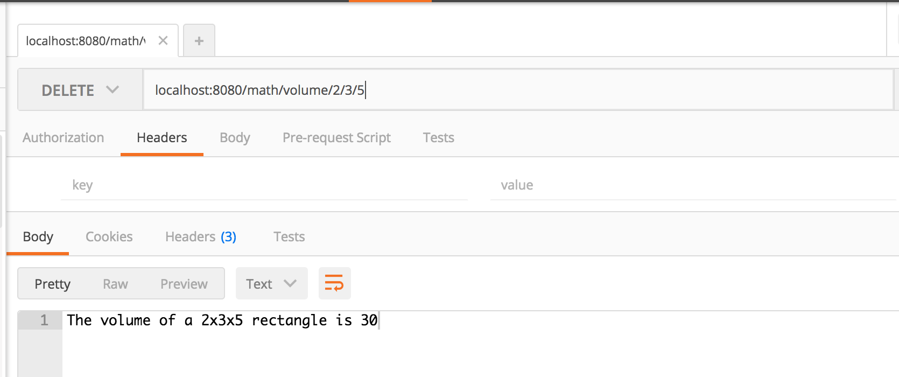
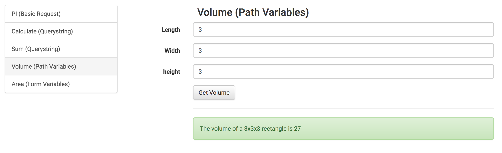

# Express Math: Volume with Path Variables

## Description

In your express-playground application, add an endpoint that accepts any verb (`GET`, `POST`, `PATCH` etc...) to `/math/volume/42/56/79`

This endpoint should take 3 path parameters:

- length
- width
- height

And return the volume of the rectangle.

### Examples

`POST /math/volume/3/4/5` should render the result `The volume of a 3x4x5 rectangle is 60`

`PATCH /math/volume/6/7/8` should render the result `The volume of a 6x7x8 rectangle is 336`

## Seeing it in Development

You should be writing tests for this.  But you may also want to see it running in your dev environment.  Here are a few options:

### cURL

```
curl -i -X POST "localhost:8080/math/volume/3/4/5"

curl -i -X PATCH "localhost:8080/math/volume/3/4/5"
```

### Postman



### API Client




### !challenge
* type: project
* id: 4f539e79-97d0-4851-a547-eaf85f88c979
* title: Volume

##### !question
1. Write a test
1. Make the tests pass
1. Commit and push your changes to GitHub

Then paste the URL to your playground repo below
##### !end-question

##### !placeholder
https://github.com/<your name>/express-playground
##### !end-placeholder

##### !explanation
Thank you!
##### !end-explanation
### !end-challenge
