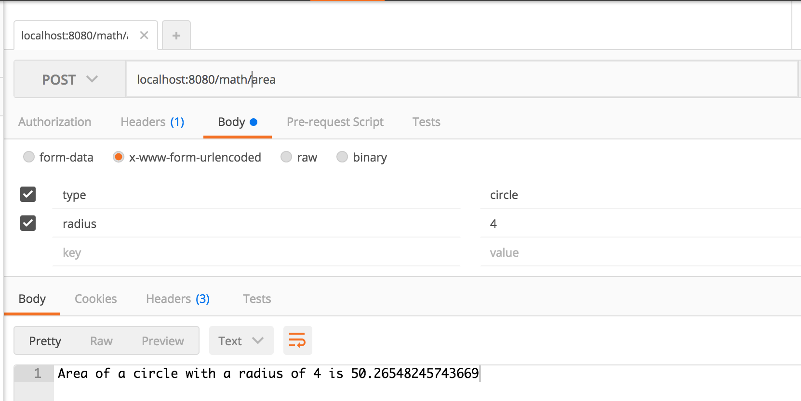
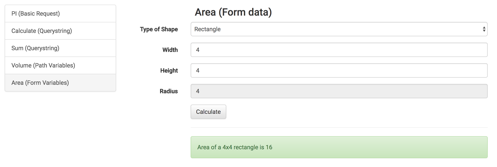

# Express Math: Area with Form Data

## Description

In your express-playground application, create an endpoint which accepts `POST` requests to `/math/area`, that takes the following parameters:

- `type`: can be `circle` or `rectangle`
- `radius`: a number
- `width`: a number
- `height`: a number

Recall that the calculation for a circle is `PI * radius^2`

Circles require a radius.  Rectangles require a width and height.  If anything is invalid, render `Invalid`

## Examples

```
POST /math/area

type=circle&radius=4
```

Would render `Area of a circle with a radius of 4 is 50.26548`

---

```
POST /math/area

type=rectangle&width=4&height=7
```

Would render `Area of a 4x7 rectangle is 28`

---

```
POST /math/area

type=rectangle&radius=5
```

Would render `Invalid`

## Seeing it in Development

You should be writing tests for this.  But you may also want to see it running in your dev environment.  Here are a few options:

### cURL

```
curl -X POST -H "Content-Type: application/x-www-form-urlencoded" -d 'type=circle&radius=4' "http://localhost:8080/math/area"
```

### Postman



### API Client




### !challenge
* type: project
* id: 1d02e99d-ff89-4291-a626-8a8b674258e0
* title: Area

##### !question
1. Write a test for circle
1. Make it pass by using an Object to get the request data
1. Write a test for rectangle
1. Make it pass
1. Write a test for the error case
1. Make it pass
1. Commit and push your changes to GitHub

Then paste the URL to your playground repo below
##### !end-question

##### !placeholder
https://github.com/<your name>/express-playground
##### !end-placeholder

##### !explanation
Thank you!
##### !end-explanation
### !end-challenge
