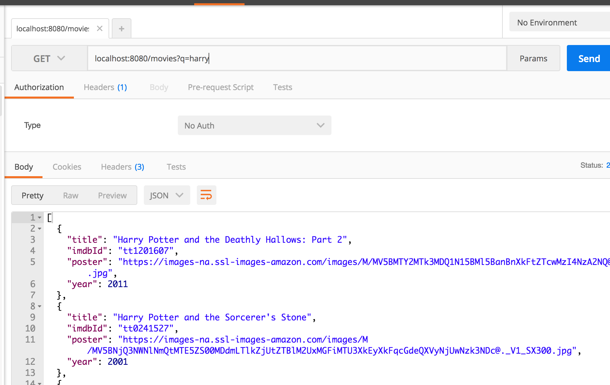
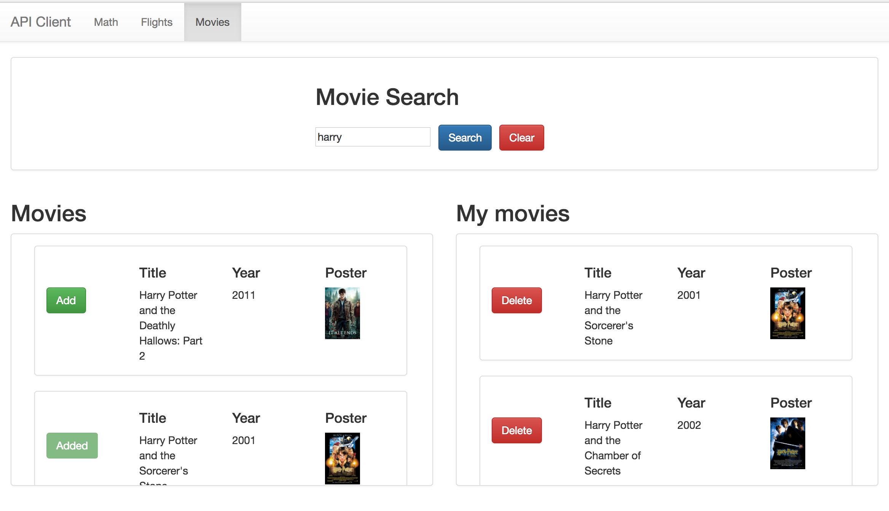

# Express Movies: With RestTemplates and OMDB

## Description

Add an endpoint to your express-playground application that connects to [OMDB](http://www.omdbapi.com/)

The endpoint should:

- Take a `GET` request to `/movies` with a query parameter named `q` for example:

  ```
  GET /movies?q=harry
  ```

- Make an HTTP call to `http://www.omdbapi.com/?s=<the value of q>` for example:

  ```
  GET http://www.omdbapi.com/?s=harry
  ```

- Return the data from the API, formatted like this (notice the capitalization):

  ```json
  [
    {
      "title": "Harry Potter and the Deathly Hallows: Part 2",
      "imdbId": "tt1201607",
      "poster": "https://images-na.ssl-imag...",
      "year": 2011
    },
    {
      "title": "Harry Potter and the Sorcerer's Stone",
      "imdbId": "tt0241527",
      "poster": "https://images-na.ssl-images-amazon.com...",
      "year": 2001
    }
  ]
  ```

## Seeing it in Development

To see this work in development, you can run:

### cURL

```
curl -i "localhost:8080/movies?q=harry"
```

### Postman



### API Client

You can _optionally_ download the API Client to help have a visual way of checking your work as you go:

https://github.com/gSchool/react-examples/tree/master/api-client




### !challenge
* type: project
* id: 690dc20e-088d-4d22-bf28-37c4e1eaa017
* title: Movies

##### !question
### Submit Your Work

Submit your URL here:
##### !end-question

##### !placeholder
https://github.com/<YOUR NAME>/express-playground/...
##### !end-placeholder

##### !explanation
Thanks!
##### !end-explanation
### !end-challenge
