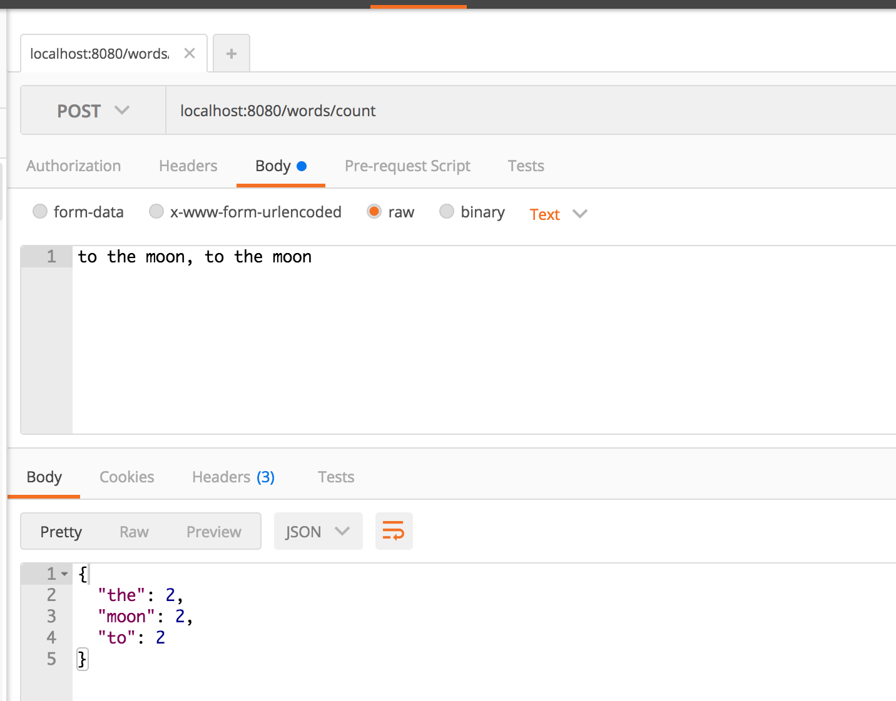

# Express Word Count: Service Class

Add an endpoint to your express-playground that can return word counts.

## Step 1 - Create the business module class

- Create a module named `wordCounter`
- Add a method named `count` that:
  - Takes a String
  - Splits on spaces and counts the words
  - Returns an object with the word counts like `{"foo": 1, "bar": 2}`

## Step 3 - Create the controller

- Create a controller
- Inject the word counter module
- Write an endpoint that:
  - Takes a `POST` to `/words/count`
  - Returns JSON of the word count

So if your application gets:

```
POST

A brown cow jumps over a brown fox
```

It would render:

```json
{
  "A": 1,
  "brown": 2,
  "cow": 1,
  "jumps": 1,
  "over": 1,
  "a": 1,
  "fox": 1
}
```

## Write a test that injects a fake word counter in the test


## Seeing it in development

### curl

```
curl -i -X POST -H 'Content-Type: text/plain' -d 'How now, brown cow' localhost:8080/words/count
```

### Postman




### !challenge
* type: project
* id: 8a8003ff-8bde-4bb2-ade7-439df696e856
* title: Word Count Service Class

##### !question
### Submit your work

Paste the link to your controller
##### !end-question

##### !placeholder
https://github.com/<YOUR NAME>/express-playground/...
##### !end-placeholder

##### !explanation
Thanks!
##### !end-explanation
### !end-challenge
