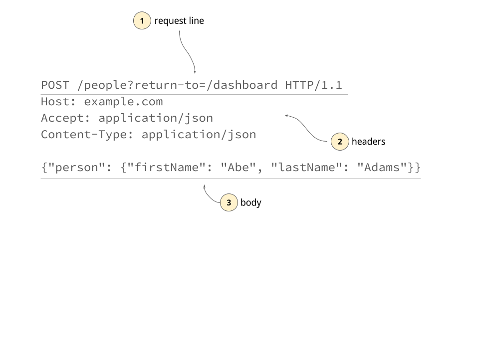
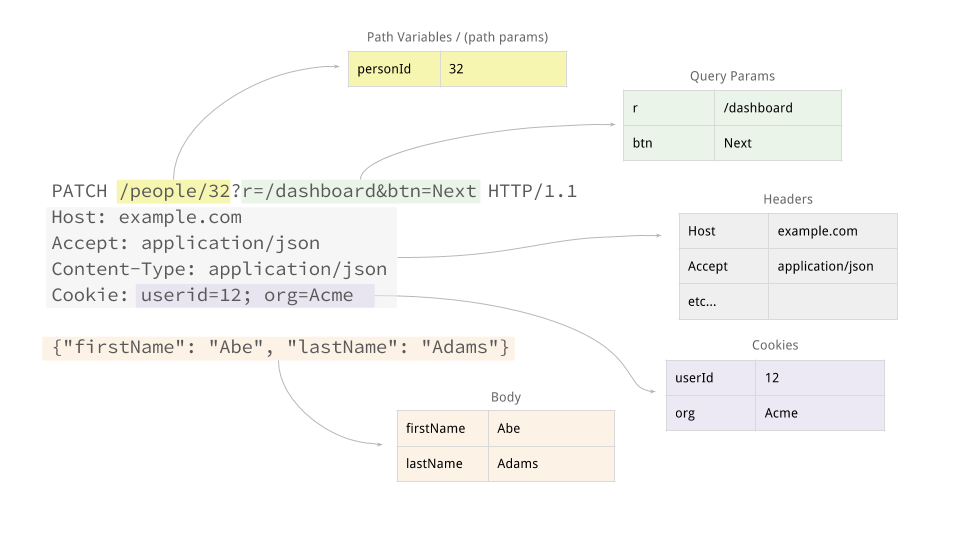

# URLs and HTTP Requests

## Objectives

By the end of this lesson you will:

1. Identify the parts of a URL
1. Identify the parts of an HTTP request
1. Identify the parts of an HTTP response

## Rationale

As you process requests and create responses in a web framework, knowing what these underlying inputs and outputs are can help you debug and search for documentation on how to access things in Express.

## #1. Identify Parts of a URL


URLs are made up:

1. The protocol (could be `http://`, `https://`, `ftp://`, `file://` etc...)
1. The host (which contains the top-level-domain, domain name and any subdomains)
1. The port (in most public-facing URLs this is omitted)
1. The path (starts with a `/`)
1. The querystring (comes after the first `?` and is a set of key-value pairs separated by `&`)
1. The hash (or anchor) which isn't generally used in server-side programming

Take a look at the path - that number "32" most likely refers to the id of the person in a database.  While the number 32 is still part of the path, you'll see that this is typically called a Path Variable in Express.

This isn't the complete URL spec, but it gives you enough to work with most web apps.


### !challenge
* type: short-answer
* id: 24642475-074f-4d7e-a452-33f283e9ea93
* title: Path

##### !question
What is the path of this URL?

```
https://example.com/?q=funny#lulz
```
##### !end-question

##### !answer
/^\/$/
##### !end-answer

##### !placeholder
Enter the path
##### !end-placeholder

##### !explanation
The path comes after the host, but ends at the question mark, so it is `/` in this case
##### !end-explanation
### !end-challenge


### !challenge
* type: short-answer
* id: 639cc0e4-41a2-4e83-acd8-7a55b93f4498
* title: Hash

##### !question
What is the path of this URL?

```
https://example.com/app/#/orders/2
```
##### !end-question

##### !answer
/^\/app\/$/
##### !end-answer

##### !placeholder
Enter the path
##### !end-placeholder

##### !explanation
The path comes after the host, but ends at the `#`, so in this case it is `/app/`
##### !end-explanation
### !end-challenge


## #2 - Identify the parts of an HTTP Request



When you type a URL into a browser, or click a link to a new page, it constructs and sends an HTTP request and sends it to the server.

HTTP requests have 3 parts:

1. The request line
1. Headers
1. Body

The request line includes the method (an HTTP verb such as `GET`, `PUT`, `POST` etc...) and also the path + querystring.

The headers are pretty self-explanatory - they are also key value pairs.  Some common headers are the `Content-Type` header, which indicate what kind of data is being sent to the server, and the `Accept` header, which indicates what kind of data the client wants _back_.  Cookies are also stored in the headers section of an HTTP request.

If the request is a POST, PUT or PATCH then it will typically include a body.  Two very common ways of encoding data in the body are as urlencoded form data (which looks identical to the querystring) or as JSON-formatted data.

You can tell which format the body will be in based on the Content-Type header.  So if the content-type is application json, you can expect the body to contain json data.


## #3 - Identify the parts of an HTTP Response

HTTP responses are almost identical to HTTP requests.  They also have 3 parts:

1. The response line
1. Headers
1. Body

The response line has a status code that indicates whether the response is a successful response, or if not, what specific error occurred.  3 very common status codes are 200 OK, 404 page not found and 500 server error.

The headers give the client information about things like what format the body is in and how long the body is.

The body itself could contain HTML, JSON, XML, CSS or encoded binary data for things like images.

## Putting it into practice



Express parses the HTTP requests for you.  To access HTTP request data you can use properties of the `req` object.

Express also generates HTTP responses for you, and takes care of most of the heavy lifting of setting the correct headers and serializing data to the body correctly.  For the most part you'll likely use `res.json` to accomplish this.
